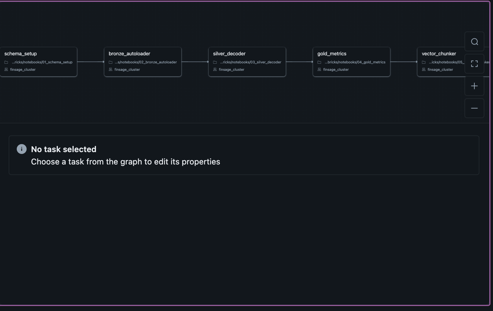

# FinSage — SEC Filing Intelligence Platform

> **Production-grade Medallion data pipeline on Databricks**, deployed as a
> Databricks Asset Bundle (DAB) with full CI/CD through GitHub Actions.

FinSage ingests annual (10-K) and quarterly (10-Q) SEC filings for 30 large-cap
companies, normalises XBRL financial metrics, extracts narrative sections, and
exposes a token-based vector index for Retrieval-Augmented Generation (RAG).

---

## Table of Contents

1. [Architecture Overview](#1-architecture-overview)
2. [Medallion Layers](#2-medallion-layers)
3. [Repository Structure](#3-repository-structure)
4. [Databricks Asset Bundles](#4-databricks-asset-bundles)
5. [CI/CD — GitHub Actions](#5-cicd--github-actions)
6. [Branch Strategy](#6-branch-strategy)
7. [Local Development](#7-local-development)
8. [Running Tests](#8-running-tests)
9. [Deployment Reference](#9-deployment-reference)
10. [Environment Variables & Secrets](#10-environment-variables--secrets)

---

## 1. Architecture Overview

```
                       ┌──────────────────────────────────────────────────┐
                       │               GitHub Repository                  │
                       │   feature/* ──► dev ──► main                     │
                       └──────────────────────┬───────────────────────────┘
                                              │  push to main
                                              ▼
                       ┌──────────────────────────────────────────────────┐
                       │            GitHub Actions Workflow               │
                       │  1. pytest (unit tests)                          │
                       │  2. databricks bundle validate                   │
                       │  3. databricks bundle deploy -t prod             │
                       └──────────────────────┬───────────────────────────┘
                                              │  deploys
                                              ▼
┌─────────────────────────────────────────────────────────────────────────────┐
│                        Databricks Workspace (prod)                          │
│                                                                             │
│  SEC EDGAR / SEC API ──► [01 Schema Setup]                                  │
│                               │                                             │
│                               ▼                                             │
│                         [02 Bronze]  ◄── Auto Loader (cloudFiles)           │
│                               │          + CompanyFacts API                 │
│                               ▼                                             │
│                         [03 Silver]  ◄── XBRL flattening + section NLP      │
│                               │                                             │
│                               ▼                                             │
│                         [04 Gold]   ◄── Metric aggregation + YoY growth     │
│                               │                                             │
│                               ▼                                             │
│                         [05 Vector] ◄── tiktoken chunking + VS index        │
│                                                                             │
│   All layers stored as Delta Lake tables in Unity Catalog (main catalog)    │
└─────────────────────────────────────────────────────────────────────────────┘
```

---

## 2. Medallion Layers

### Bronze — Raw Ingestion (`main.finsage_bronze`)

The Bronze layer is **append-only and auditable**.  No business logic is applied.

| Table | Contents |
|---|---|
| `filings` | Raw binary bytes of every SEC filing file, ingested via Databricks Auto Loader (`cloudFiles` format). Exactly-once delivery is guaranteed by the Auto Loader checkpoint. |
| `xbrl_companyfacts_raw` | Raw JSON payloads from the SEC EDGAR CompanyFacts API (`/api/xbrl/companyfacts/CIK{cik}.json`). One row per ticker per day. |
| `ingestion_errors` | Every download failure, HTTP error, or parse exception from any layer, logged here for observability and reprocessing. |
| `sec_filings_download_log` | Idempotency log for the `sec-edgar-downloader` parallel download job. Prevents duplicate API calls on re-runs. |

**Key design decisions:**
- `delta.enableChangeDataFeed = true` on all Bronze tables enables downstream Change Data Capture.
- Auto Loader's `availableNow=True` trigger makes the stream behave like a batch — process all new files, then stop.

### Silver — Cleaned & Parsed (`main.finsage_silver`)

Silver applies two independent transformations to Bronze data:

| Table | Transformation |
|---|---|
| `financial_statements` | XBRL CompanyFacts JSON is flattened using `TARGET_CONCEPT_MAP` — a canonical mapping of 30+ raw XBRL concepts to 11 normalised metric names (`revenue`, `net_income`, etc.). Deduplicated via SHA-256 `statement_id`. Idempotent MERGE on every run. |
| `filing_sections` | 10-K HTML filing bytes are decoded, stripped of HTML tags, Base64 images, and scripts, then parsed into three named sections — **Business (Item 1)**, **Risk Factors (Item 1A)**, and **MD&A (Item 7)** — using regex boundary detection. Section boundaries are deterministic and auditable. |

**Key design decisions:**
- `TARGET_CONCEPT_MAP` is the single source of truth for metric normalisation and is unit-tested independently of Spark (see `tests/unit/test_normalizer.py`).
- Only `10-K` filings are processed in section extraction — quarterly reports lack the Item 1/7 structure.

### Gold — Analytical Metrics (`main.finsage_gold`)

Gold produces a **wide, analyst-ready** table per ticker-year with derived KPIs.

| Table | Contents |
|---|---|
| `company_metrics` | One row per `(ticker, fiscal_year)`. Contains 16 financial metrics, gross margin %, revenue YoY growth %, debt-to-equity ratio, and a `data_quality_score` (0–1) indicating how many of the 9 core metrics were populated. |
| `filing_section_chunks` | Token-based chunks (512 tokens, 64-token overlap) of Silver sections, with deterministic SHA-256 `chunk_id` for idempotent merges. |

**Key design decisions:**
- Strict fiscal-period alignment: only `fiscal_period = 'FY'` facts are used, and `duration_days` must be 350–380 for flow metrics.
- Canonical accession selection: one `accession_number` per `(ticker, fiscal_year)` is chosen based on required-metric coverage before any aggregation.

### Vector Layer — RAG Index (`main.finsage_gold`)

| Resource | Contents |
|---|---|
| `filing_section_chunks` (Gold) | Source table with `delta.enableChangeDataFeed = true`. |
| `filing_chunks_index` | Databricks Vector Search Delta Sync index backed by `databricks-bge-large-en`. Supports similarity search for downstream RAG agents. |

---

## 3. Repository Structure

```
FinSage/
├── databricks.yml                     # Databricks Asset Bundle root config
├── databricks/
│   ├── notebooks/
│   │   ├── 01_schema_setup.py         # DDL: schemas, tables, volumes
│   │   ├── 02_bronze_autoloader.py    # Auto Loader + SEC API ingestion
│   │   ├── 03_silver_decoder.py       # XBRL flattening + section extraction
│   │   ├── 04_gold_metrics.py         # Metric aggregation + KPI derivation
│   │   └── 05_vector_chunker.py       # Chunking + Vector Search setup
│   └── workflows/                     # (reserved for future workflow YAMLs)
├── terraform/
│   └── main.tf                        # Cluster policy, secret scope, SP lookup
├── .github/
│   └── workflows/
│       └── deploy.yml                 # CI/CD pipeline (pytest → validate → deploy)
├── tests/
│   └── unit/
│       └── test_normalizer.py         # pytest: TARGET_CONCEPT_MAP coverage
├── assets/
│   └── screenshots/
│       └── finsage_dag_databricks.png # Live DAG view from Databricks workspace
├── src/
│   ├── ingestion/                     # Legacy downloader scripts
│   ├── processing/
│   ├── retrieval/
│   ├── serving/
│   └── agent/
├── docs/
│   ├── FinSage_blueprint_v2.html
│   ├── challenges_log.html
│   └── technical_decisions.html
├── requirements.txt
└── README.md
```

> **Databricks notebook source files:** Every `.py` file under `databricks/notebooks/`
> starts with `# Databricks notebook source`.  When uploaded to a Databricks workspace
> (which the DAB deploy step does automatically), Databricks recognises them as
> interactive notebooks while they remain plain Python files in Git — giving you the
> best of both worlds.

---

## 4. Databricks Asset Bundles

FinSage is deployed as a **Databricks Asset Bundle (DAB)**.  The entire job
topology — clusters, tasks, schedules, and environment promotion — is defined in
`databricks.yml` at the repository root.

### Bundle structure

```yaml
bundle:
  name: finsage_pipeline

resources:
  jobs:
    finsage_daily_run:
      tasks:
        - task_key: schema_setup        # 01_schema_setup.py
        - task_key: bronze_autoloader   # 02_bronze_autoloader.py  (depends_on: schema_setup)
        - task_key: silver_decoder      # 03_silver_decoder.py     (depends_on: bronze_autoloader)
        - task_key: gold_metrics        # 04_gold_metrics.py       (depends_on: silver_decoder)
        - task_key: vector_chunker      # 05_vector_chunker.py     (depends_on: gold_metrics)
```

Tasks are **strictly sequential** via `depends_on`.  If any task fails, all
downstream tasks are skipped and an email alert fires.

### Targets

| Target | Mode | Purpose |
|---|---|---|
| `dev` (default) | `development` | Personal deployment; job names prefixed; safe to iterate. |
| `prod` | `production` | Shared deployment; no name prefix; triggered by CI/CD on `main`. |

### CLI commands

```bash
# Validate the bundle (syntax + workspace connectivity check)
databricks bundle validate

# Deploy to dev (default target)
databricks bundle deploy

# Deploy to a specific target
databricks bundle deploy -t prod

# Run the job manually in dev
databricks bundle run finsage_daily_run

# Run the job manually in prod
databricks bundle run -t prod finsage_daily_run

# Destroy all deployed resources (dev only — never run in prod without approval)
databricks bundle destroy
```

### Live DAG — Databricks Workspace

The screenshot below shows the `finsage_daily_run` job as it appears in the Databricks
Jobs & Pipelines UI after a successful `databricks bundle deploy`.  All five tasks are
connected as a strictly sequential DAG, sharing the `finsage_cluster` job cluster to
avoid cold-start overhead between tasks.



> The job is marked **[dev Digvijay]** in development mode — DAB automatically prefixes
> the job name with the deploying user to prevent collisions with the production
> `finsage_daily_run` job in the same shared workspace.

---

## 5. CI/CD — GitHub Actions

The workflow file is `.github/workflows/deploy.yml`.

### Pipeline stages

```
push to main
     │
     ▼
┌────────────────┐     fails     ┌─────────────────────────────────────────┐
│  unit-tests    │──────────────►│  Pipeline stops. No deployment occurs.  │
│  (pytest)      │               └─────────────────────────────────────────┘
└───────┬────────┘
        │ passes
        ▼
┌────────────────────────┐
│  bundle-validate       │  databricks bundle validate
│  (Databricks CLI)      │
└────────────┬───────────┘
             │ passes
             ▼
┌────────────────────────┐
│  deploy-prod           │  databricks bundle deploy -t prod
│  (Databricks CLI)      │
└────────────────────────┘
```

### Workflow behaviour

| Trigger | unit-tests | bundle-validate | deploy-prod |
|---|---|---|---|
| Push to `main` | Yes | Yes | Yes |
| Pull request to `main` | Yes | No | No |
| Push to `dev` or feature branch | No | No | No |

### Authentication

The CLI uses **OAuth Machine-to-Machine (M2M)** authentication via a Service Principal.
Legacy Personal Access Tokens (PATs) are disabled in this workspace per enterprise policy.

| Secret | Value |
|---|---|
| `DATABRICKS_HOST` | `https://<your-workspace>.cloud.databricks.com` |
| `DATABRICKS_CLIENT_ID` | Application (client) ID of the `finsage-service-principal` |
| `DATABRICKS_CLIENT_SECRET` | OAuth secret of the `finsage-service-principal` |

Add these under **Settings → Secrets and variables → Actions** in your GitHub repository.

To provision the Service Principal (requires Databricks admin access):
1. Create a Service Principal in your identity provider (Entra ID / Okta).
2. Grant the SP the **Can Manage** role on the Databricks workspace.
3. Generate an OAuth secret for the SP.
4. Add the three secrets above to GitHub.

---

## 6. Branch Strategy

```
main          ──── protected; requires PR + passing CI ────────────────────────►
                         ▲                    ▲
                         │ merge              │ merge
dev           ──── integration testing ───────┘
                         ▲
                         │ merge
feature/*     ──── individual feature work ──────────────────────────────────►
```

| Branch | Purpose | Deploys to |
|---|---|---|
| `feature/*` | New features, bug fixes. Short-lived. | Nothing (CI unit tests only on PR) |
| `dev` | Integration testing; staging-equivalent. | Databricks `dev` target (manual `bundle deploy`) |
| `main` | Production-ready code. Merge-only via PR. | Databricks `prod` target (automated via GitHub Actions) |

### Release process

1. Create a `feature/my-change` branch from `main`.
2. Develop and test locally (see §7).
3. Open a Pull Request to `main`.  GitHub Actions runs unit tests automatically.
4. After PR approval and CI passes, merge to `main`.
5. The CI/CD pipeline automatically validates and deploys to `prod`.

> **Hotfixes:** Branch directly from `main`, apply the fix, open a PR.  Do not
> bypass the PR process — the `bundle validate` gate is your last line of defence
> before production.

---

## 7. Local Development

### Prerequisites

- Python 3.11+
- [Databricks CLI v0.218+](https://docs.databricks.com/dev-tools/cli/databricks-cli.html)
- A Databricks workspace with Unity Catalog enabled

### Setup

```bash
# 1. Clone the repo
git clone https://github.com/<your-org>/FinSage.git
cd FinSage

# 2. Create a virtual environment
python -m venv .venv
source .venv/bin/activate

# 3. Install dependencies
pip install -r requirements.txt

# 4. Configure the Databricks CLI using OAuth U2M (browser-based login for local dev)
databricks auth login --host https://dbc-f33010ed-00fc.cloud.databricks.com/
# Your browser will open for a one-time login. No PAT required.
# In CI, authentication uses DATABRICKS_CLIENT_ID + DATABRICKS_CLIENT_SECRET (M2M OAuth).

# 5. Deploy to your personal dev environment
databricks bundle deploy       # deploys to the 'dev' target by default

# 6. Trigger a manual run
databricks bundle run finsage_daily_run
```

---

## 8. Running Tests

Tests live under `tests/unit/` and have **no Spark dependency** — they run on
plain Python using only the standard library and pytest.

```bash
# Run all unit tests
pytest tests/unit/ -v

# Run with coverage report
pytest tests/unit/ -v --cov=databricks/notebooks --cov-report=term-missing

# Run a single test file
pytest tests/unit/test_normalizer.py -v
```

### What is tested

| Test file | What it covers |
|---|---|
| `test_normalizer.py` | `TARGET_CONCEPT_MAP` in `03_silver_decoder.py`. Asserts that every XBRL concept resolves to the expected normalised metric name, that unknown concepts return `None`, and that the map is structurally complete. |

---

## 9. Deployment Reference

### First-time setup

```bash
# Validate bundle (checks YAML + workspace permissions)
databricks bundle validate

# Deploy to dev
databricks bundle deploy

# Deploy to prod (normally done by CI, but can be run manually)
databricks bundle deploy -t prod
```

### Updating an existing deployment

```bash
# After any notebook or databricks.yml change:
git add .
git commit -m "feat: update silver section extraction regex"
git push origin main
# → GitHub Actions handles the rest
```

### Monitoring a running job

```bash
# List recent job runs
databricks jobs list-runs --job-id <job-id>

# View logs for a specific run
databricks runs get-output --run-id <run-id>
```

---

## 10. Environment Variables & Secrets

| Name | Where set | Purpose |
|---|---|---|
| `DATABRICKS_HOST` | GitHub Secret | Workspace URL for CLI authentication in CI |
| `DATABRICKS_CLIENT_ID` | GitHub Secret | Service Principal client ID for M2M OAuth in CI |
| `DATABRICKS_CLIENT_SECRET` | GitHub Secret | Service Principal OAuth secret for M2M auth in CI |
| `USER_AGENT` | Notebook widget default | Identifies FinSage to the SEC EDGAR API (required by SEC ToS) |

> **Never commit secrets to Git.**  The `.gitignore` already excludes `.env` files.
> Use GitHub Secrets for CI and the Databricks secret scope (`databricks secrets`)
> for runtime secrets inside notebooks.

---

## Licence

Internal project — Arsaga Partners.  All rights reserved.
